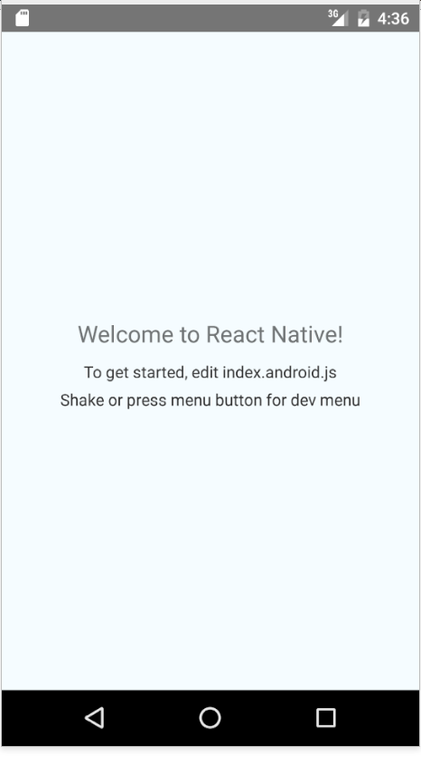
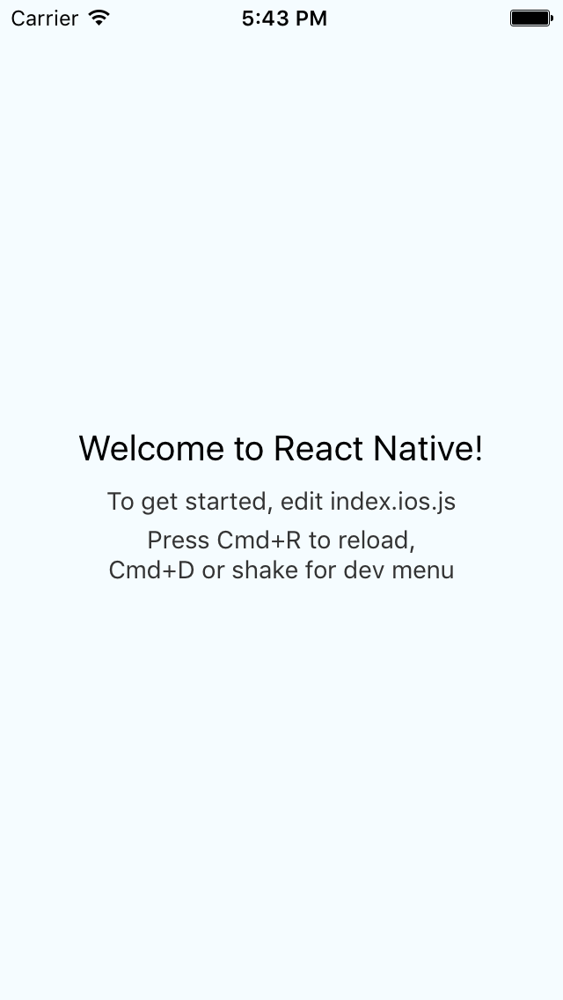

# React native
## First steps

Jürno Ader

- Twitter: [@jyrno42](https://twitter.com/jyrno42)
- GitHub: [github.com/jyrno42](https://github.com/jyrno42)
- Slides: [github.com/jyrno42/knowledge_react_native](https://github.com/jyrno42/knowledge_react_native)

Note:

    Hello, this talk is about the first steps with react native. Please bear in mind, that i have only done
    react-native for three days. However, if there are questions i can't anwser i will be ready to anwser them
    afterwards.

---

## Agenda

- Introduction
- What is React Native
  - Problems it solves
  - Alternatives
- Getting started
- Thoughts
- Q&A

***

## What is react native?

Note:

    So what is React Native?

---

- View Libary
 - Compiles & Binds JS to
   - IOS Cocoa Touch
   - Android UI
   - More to come
 - Flexbox based layout system

- Applications run fast
- Scalable
- Extensible
- Native components / bindings supported


Note:

    React native targets(that have not been released yet) include: Windows Phone, Windows app store, web, native linux and more

---

## Problems React Native solves

- Use existing skill sets to write native applications
- Accidentally writing cross platform apps
- Faster prototyping of new JS features for web

Note:

You might ask, why react native? Well, we have all written something with
react, react-native just takes the react concepts and gives familiar feel
when writing native apps.

Another fun thing the author of "Learning react native" Bonnie Eisenman
pointed out in her this years ReactEurope talk, it allows one to
accidentally write cross platform code.

---

## Alternatives

- Xamarin
- Titanium
- HTML5


Note:

Xamarin: C# based cross-platform native app framework. With Xamarin you also have to construct separate iOS and Android
UIs. The difference between the two is fundamentally a language preference, however Xamarin does have the maturity advantage.

Titanium: JS based native UI platform

Aside from Titanium, there is a huge community of developers writing cross platform applications via the various other myriad
frameworks at their disposal (e.g. Phonegap). If you are currently using one of those HTML5 frameworks, you should definitely give React
Native a try.

***

## Getting started

```bash
npm install -g react-native-cli
```

Note:

Installing it is as easy as running the following command. However, using react-native also means one needs to set up their
Android / IOS development environment, which i won't go into detail right now.

---

## Init & run your first app

```bash
# Init project
react-native init AwesomeProject
cd AwesomeProject
react-native start

# In another terminal
cd AwesomeProject
react-native run-android
```

Note:

Creating our hello world app just takes these three commands, and if all goes well, the following should appear in your emulator.

---

<div class="hello-screens">


</div>

---

```js
/**
 * Sample React Native App
 * https://github.com/facebook/react-native
 * @flow
 */

import React, { Component } from 'react';
import {
  AppRegistry,
  StyleSheet,
  Text,
  View
} from 'react-native';

class AwesomeProject extends Component {
  render() {
    return (
      <View style={styles.container}>
        <Text style={styles.welcome}>
          Welcome to React Native!
        </Text>
        <Text style={styles.instructions}>
          To get started, edit index.android.js
        </Text>
        <Text style={styles.instructions}>
          Shake or press menu button for dev menu
        </Text>
      </View>
    );
  }
}

const styles = StyleSheet.create({
  container: {
    flex: 1,
    justifyContent: 'center',
    alignItems: 'center',
    backgroundColor: '#F5FCFF',
  },
  welcome: {
    fontSize: 20,
    textAlign: 'center',
    margin: 10,
  },
  instructions: {
    textAlign: 'center',
    color: '#333333',
    marginBottom: 5,
  },
});

AppRegistry.registerComponent('AwesomeProject', () => AwesomeProject);
```

Note:

TALK: Explain what the lines in the source do, give some tiny info about styles, etc

***

## Thoughts


Note:

There’s a lot to like about React Native, here are the parts i like


---

## Good parts

- React
- Developer menu (cmd+m in mac, ctrl+m in win/linux)
- Reload without rebuilding app, hot/live reload builtin
- The packager
- Remote chrome debugging (animated will be slow as hell though)
- Cross platform
- Flexbox
- Can use native components/bindings

---

## Bad parts

- Documentation
- When stuff doesn't work, it's quite difficult to figure out why (cryptic errors)
- Styles module is a bit of a pain to work with (at first)
- Very customized controls need to be implemented in native code
- Animations are fast, but the libary is lacking certain math helpers
- IT IS AN ABSTRACTION

***

## Thank you

- Slides: [github.com/jyrno42/knowledge_react_native](https://github.com/jyrno42/knowledge_react_native)
- Demo app Code: [github.com/Jyrno42/eurobet-native](https://github.com/Jyrno42/eurobet-native)


Note:

Thanks everyone. Now its time for a QA

## QA
